# Overview
This is for the completion of Project 2 in Udacity's Azure ML Nanodegree. The goal of the project is to demonstrate the multiple ways to train a model using Azure, specifically a classification model based on the bank-marketing data provided.

The project had me train a model first using the GUI interface, then train a model on pre-defined resources using the SDK and an existing experiment, then lastly to train a model from scratch using the SDK.

# Architecture
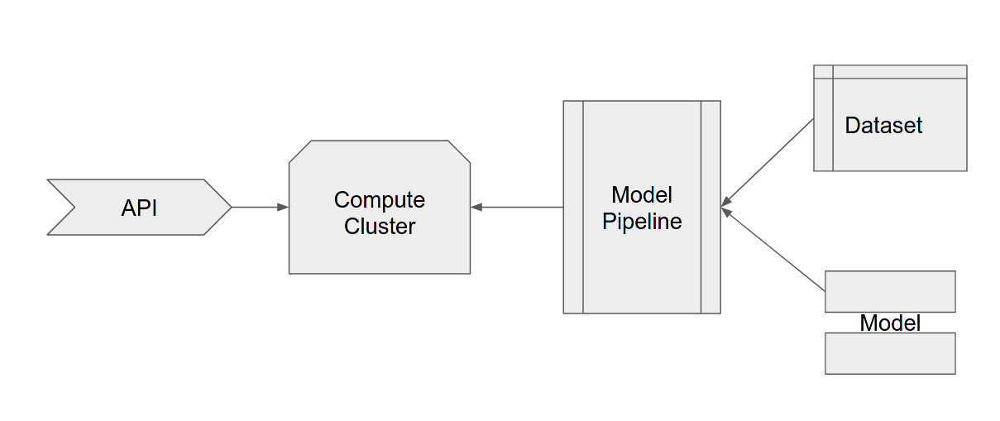

# Development
The development of this was split into the following sections, as defined by the project:

## Authentication
Per the directions, this was skipped as I was using the Udacity-provided instances

## Automated ML Experiment
The bank-marketing dataset came pre-loaded in the provided instance. I ran an experiment through the GUI on this dataset:

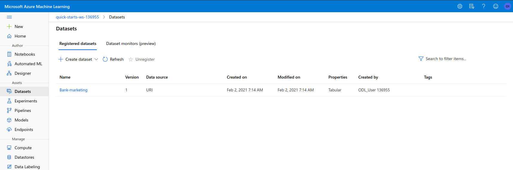
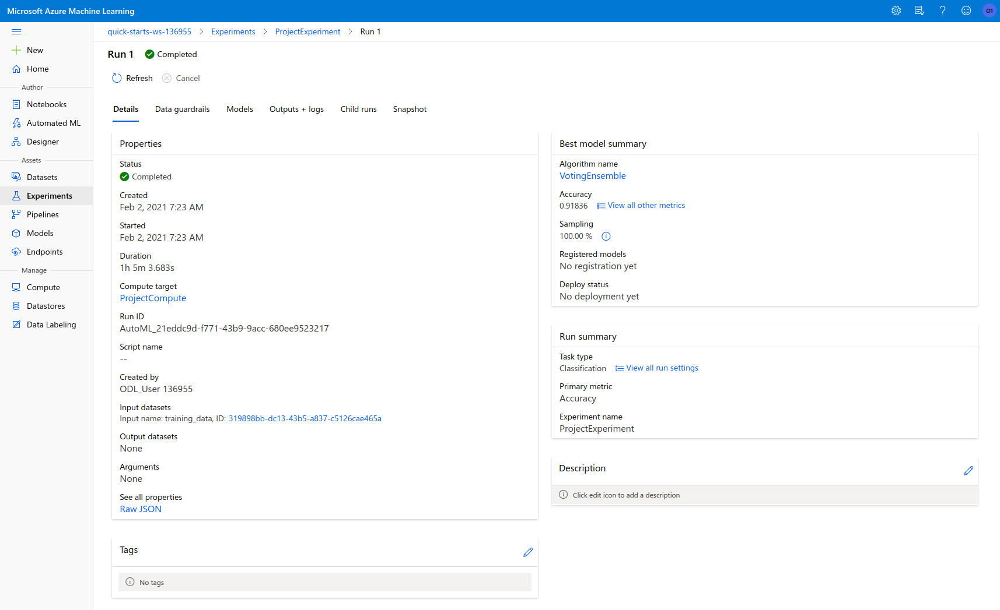

## Deploy best model
After the experiment was complete, I thin deployed the best model with authentication and as an ACI. No screenshots were requested for this section.

## Enable Logging
Next I enabled the Application Insights logging and validated that it was working correctly:

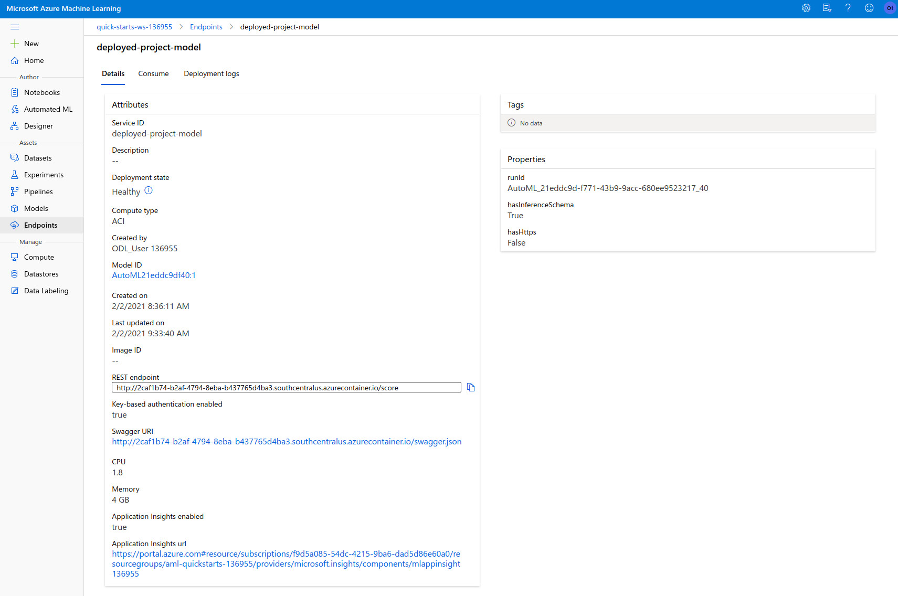
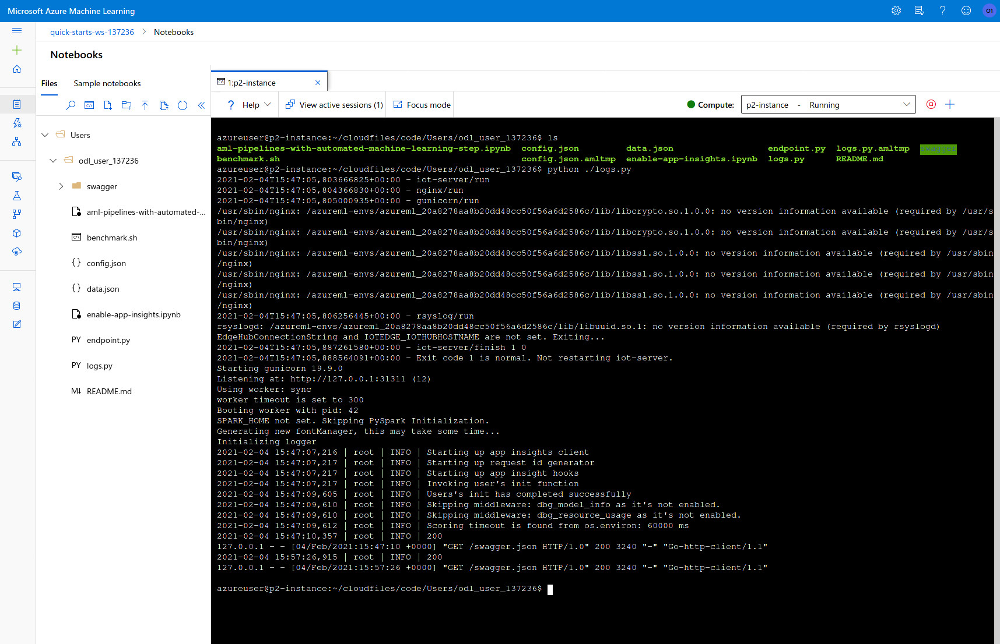

## Swagger Documentation
Then I implemented a Swagger documentation of the API endpoints:

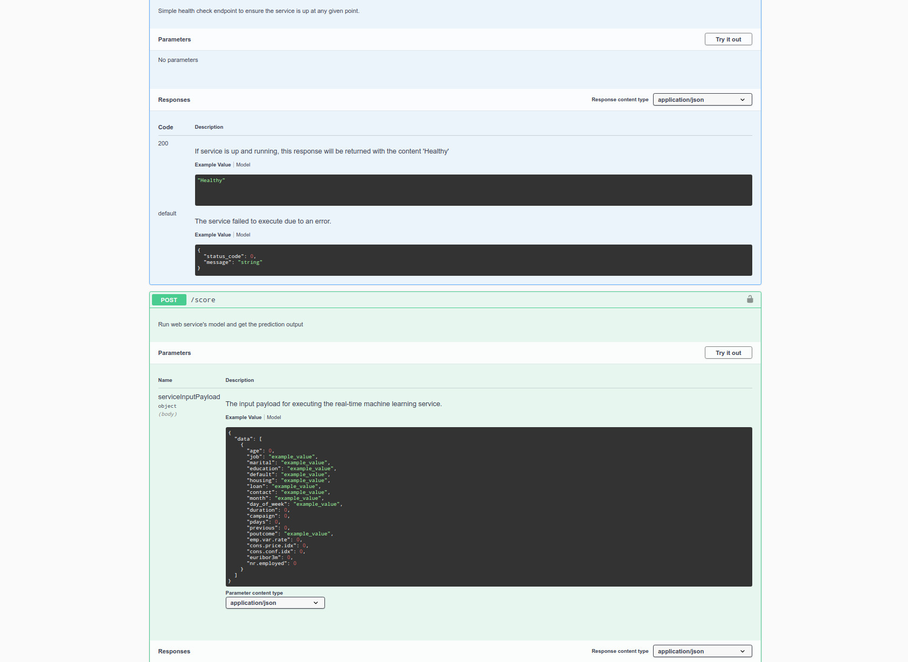

## Consume Model Endpoints
Then I used the provided `endpoint.py` script to validate the API was working correctly:

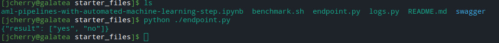

## Create, Publish and Consume a Pipeline
The next step was for me to run through the provided notebook file to execute the same training process using the SDK, with the same dataset as exampled above:

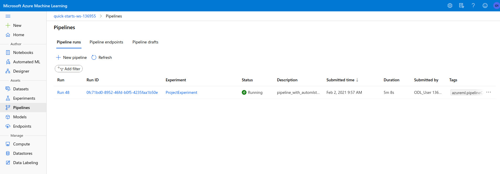
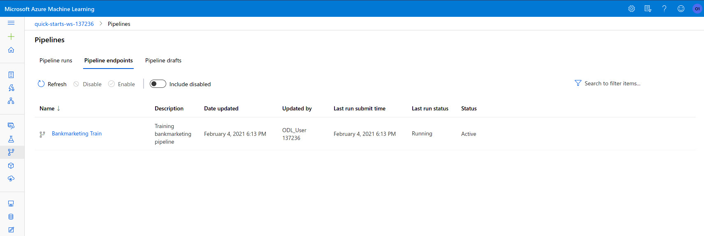
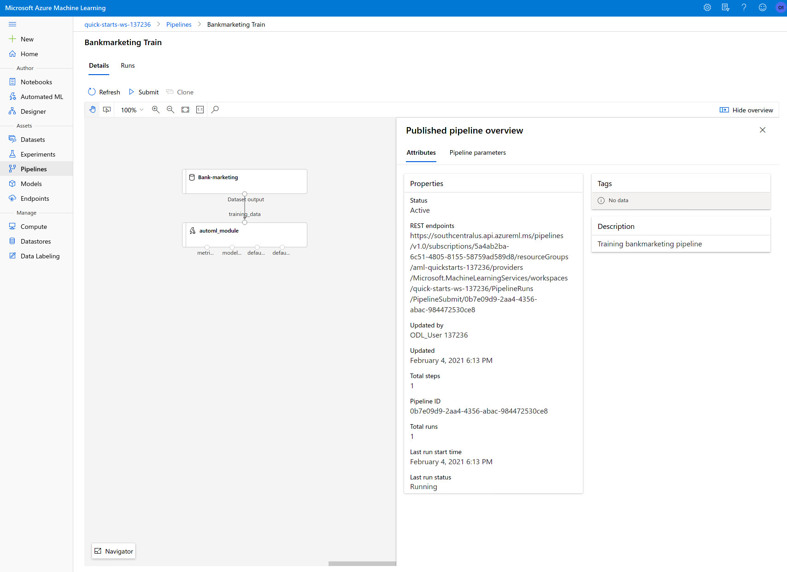

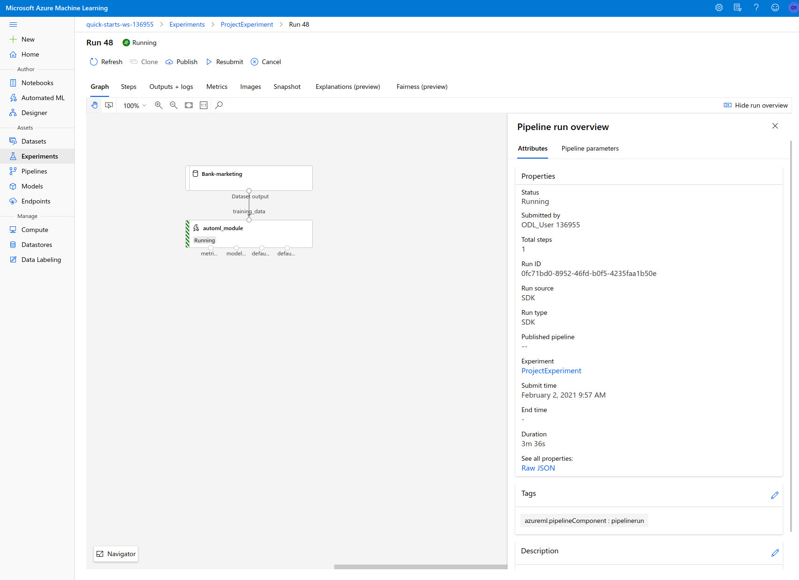

## Documentation
Lastly I compined everything I did together in this documentation, including a [screencap video](https://www.youtube.com/watch?v=JA_LOPhM960).

# Improvements
Using deep learning approaches could improve the model results, as it would open up more powerful (though more complex/slower) techniques.

Additionally, some extra consideration on the features of the dataset are warranted. The dataset was taken as-is without any thought to feature engineering.
